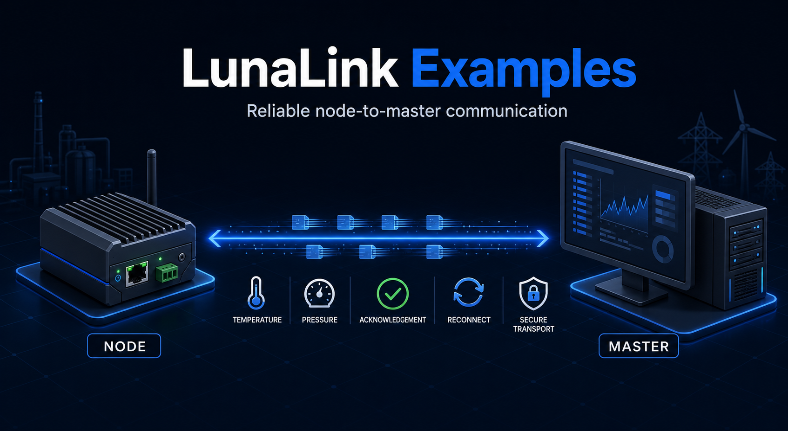
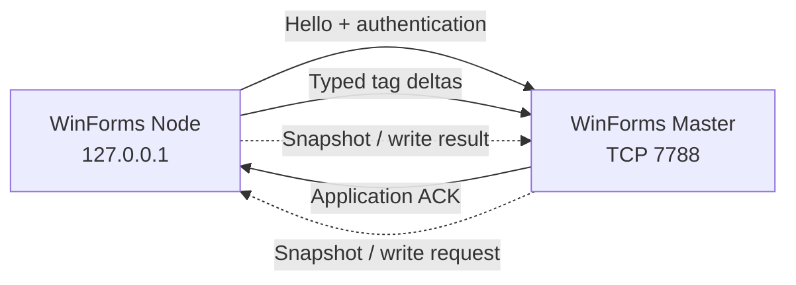

# LunaLink Examples

[](https://github.com/lunasoft-llc/lunalink-examples/actions/workflows/build.yml)
[](https://www.nuget.org/packages/LunaLink/)
[](https://dotnet.microsoft.com/)
[](LICENSE)

Official, runnable Windows Forms examples for integrating the [LunaLink](https://www.nuget.org/packages/LunaLink/) node-to-master protocol into a .NET application.

The repository contains only example application code. LunaLink is installed as a NuGet dependency; its proprietary source code is not included or exposed.

## What you will learn

- Start and stop a LunaLink Master listener.
- Connect and disconnect an edge Node.
- Publish typed telemetry batches.
- Receive live tag values on the Master.
- Implement snapshots and remote-write callbacks.
- Observe connection, acknowledgement, retry, and application events.
- Configure authentication and prepare the transport for TLS/mTLS.

## Included applications

| Application | Role | Demonstrates |
|---|---|---|
| `LunaLink.Examples.Master` | Master | TCP listener, node registration, live tag table, status and structured logs |
| `LunaLink.Examples.Node` | Node | Master connection, simulated temperature/pressure telemetry, snapshots, remote-write callback and structured logs |

Both applications use the same compact LunaSoft-inspired visual system and expose explicit lifecycle controls.

## Architecture



The Node publishes two simulated `Float64` tags:

| Tag | Unit | Stable demo ID |
|---|---|---|
| `demo.temperature` | °C | `a82dfaa9-b4aa-46ad-9b41-91a92f976001` |
| `demo.pressure` | bar | `a82dfaa9-b4aa-46ad-9b41-91a92f976002` |

## Requirements

- Windows 10 or later
- [.NET 10 SDK](https://dotnet.microsoft.com/download)
- Network access to NuGet.org during the first restore
- TCP port `7788` available locally

Confirm the SDK:

```powershell
dotnet --version
```

## Quick start

Clone the examples and restore dependencies:

```powershell
git clone https://github.com/lunasoft-llc/lunalink-examples.git
cd lunalink-examples
dotnet restore .\LunaLink.Examples.slnx
```

Open two terminals from the repository root.

### 1. Start the Master

```powershell
dotnet run --project .\src\LunaLink.Examples.Master
```

Click **Start listening**. The status changes to `LISTENING • 7788`.

### 2. Start the Node

```powershell
dotnet run --project .\src\LunaLink.Examples.Node
```

Click **Connect**, wait for `CONNECTED`, then click **Start publishing**.

### 3. Verify the result

The Master should show:

- the connected Node identity;
- `demo.temperature` and `demo.pressure` in the live-tag table;
- continuously updated values and timestamps;
- connection and acknowledgement activity in the log panel.

Use **Stop publishing**, **Disconnect**, and **Stop listening** for a clean shutdown. Closing either window also stops its LunaLink background service.

## Configuration

Configuration lives in each application's `appsettings.json` and binds to `LunaLinkOptions`.

### Master

```json
{
  "LunaLink": {
    "Port": 7788,
    "AuthToken": "change-me-local-only"
  }
}
```

### Node

```json
{
  "LunaLink": {
    "MasterHost": "127.0.0.1",
    "Port": 7788,
    "NodeId": "winforms-demo-node",
    "NodeName": "WinForms Demo Node",
    "AuthToken": "change-me-local-only"
  }
}
```

| Setting | Application | Purpose |
|---|---|---|
| `MasterHost` | Node | Master hostname or IP address |
| `Port` | Both | LunaLink TCP port; default is `7788` |
| `NodeId` | Node | Stable unique identity; do not reuse it for multiple active nodes |
| `NodeName` | Node | Human-readable name shown by the Master |
| `AuthToken` | Both | Shared authentication secret; values must match |
| `LicenseKey` | Node | Optional LunaLink license key |
| `UseTls` | Both | Enables TLS transport |

To connect from another machine, replace `127.0.0.1` with the Master's reachable address and allow inbound TCP `7788` in the Master's firewall.

## TLS and mutual TLS

The examples use plain TCP only for local development. For any non-local or untrusted network, enable TLS and use secrets outside committed configuration.

Master settings:

```json
{
  "LunaLink": {
    "Port": 7788,
    "UseTls": true,
    "CertificatePath": "certs/master.pfx",
    "CertificatePassword": "load-from-a-secret-provider",
    "ClientCertificateRequired": true
  }
}
```

Node settings:

```json
{
  "LunaLink": {
    "MasterHost": "master.example.com",
    "Port": 7788,
    "UseTls": true,
    "ValidateServerCertificate": true,
    "ClientCertificatePath": "certs/node.pfx",
    "ClientCertificatePassword": "load-from-a-secret-provider"
  }
}
```

Never disable server-certificate validation outside a controlled development environment.

## Freemium behavior

Without a license key, LunaLink runs in Freemium mode:

- up to 50 unique tags;
- live connected delivery is available;
- persistent offline outbox is not available.

The example disables publishing after an explicit disconnect. A licensed production Node can use LunaLink's durable outbox and ordered replay for temporary network outages.

## Code guide

### Master

- `Program.cs` configures dependency injection and application lifetime.
- `MasterServerController.cs` owns repeatable listener start/stop behavior.
- `MasterCallback.cs` receives node registration and tag values.
- `MasterEvents.cs` safely bridges protocol callbacks into the UI.
- `MainForm.cs` renders status, live values, controls, and logs.

### Node

- `Program.cs` configures the LunaLink client dependencies.
- `NodeClientController.cs` owns connect/disconnect and publishing access.
- `NodeCallback.cs` supplies snapshots and handles remote-write requests.
- `NodeState.cs` stores the two current demo values.
- `MainForm.cs` generates and publishes one telemetry batch per second.

### Shared UI

- `src/Shared/UiTheme.cs` keeps both applications visually consistent.
- `UiLogProvider.cs` sends standard `Microsoft.Extensions.Logging` events to the activity console.

## Extending the examples

To add a tag:

1. Give it a stable `Guid` in `NodeState`.
2. Store its current `LunaLinkTagSnapshot`.
3. Add it to the batch passed to `SendAsync`.
4. Keep its declared `LunaLinkDataType` consistent with its value.

`NodeCallback.WriteTagAsync` is the extension point for Master-to-Node writes. A real application must validate authorization, value range, operating state, and device feedback before accepting a control command.

## Troubleshooting

### `Connection refused` or repeated retry logs

- Start the Master listener before connecting the Node.
- Confirm both applications use the same port.
- Check that no other process owns port `7788`:

```powershell
Get-NetTCPConnection -LocalPort 7788 -ErrorAction SilentlyContinue
```

### Authentication is rejected

Confirm that `AuthToken` is identical in both `appsettings.json` files. Restart both applications after changing configuration.

### No tags appear

- Wait until the Node status shows `CONNECTED`.
- Click **Start publishing**.
- Check both activity logs for serialization, licensing, or acknowledgement errors.

### `Outbox is not initialized`

Restore and build the current repository version. The Node startup explicitly initializes the outbox before starting LunaLink `1.0.48`.

### Port `7788` is already in use

Stop the other listener or choose the same unused port in both applications.

### Certificate errors

Verify the PFX path/password, certificate validity, hostname/SAN, trust chain, and client-certificate requirement. Do not bypass validation as a production fix.

## Build and validation

```powershell
dotnet restore .\LunaLink.Examples.slnx
dotnet build .\LunaLink.Examples.slnx -c Release --no-restore
```

The GitHub Actions workflow performs the same restore and Release build on Windows for pushes and pull requests targeting `main`.

## Security

- The committed token is for loopback development only.
- Never commit production tokens, license keys, certificate passwords, private certificates, or unsanitized logs.
- Keep safety interlocks and emergency protection in the PLC or dedicated hardware—not in a desktop example.
- Validate and audit every remote write in a production integration.
- Report vulnerabilities privately as described in [SECURITY.md](SECURITY.md).

## Scope

These examples demonstrate integration mechanics; they are not a production SCADA application, historian, alarm system, or safety controller. Production deployments require application-specific persistence, authorization, observability, certificate management, recovery testing, and hardware acceptance.

## Contributing

Read [CONTRIBUTING.md](CONTRIBUTING.md) before opening a pull request. Reproducible example bugs can be submitted through the included GitHub issue template.

## Support

- LunaLink package: [NuGet.org](https://www.nuget.org/packages/LunaLink/)
- Product and licensing: [lunasoft.az](https://lunasoft.az)
- Example issues: [GitHub Issues](https://github.com/lunasoft-llc/lunalink-examples/issues)

## License

The source code in this examples repository is available under the [MIT License](LICENSE). The LunaLink NuGet package is distributed separately under its own proprietary license.
